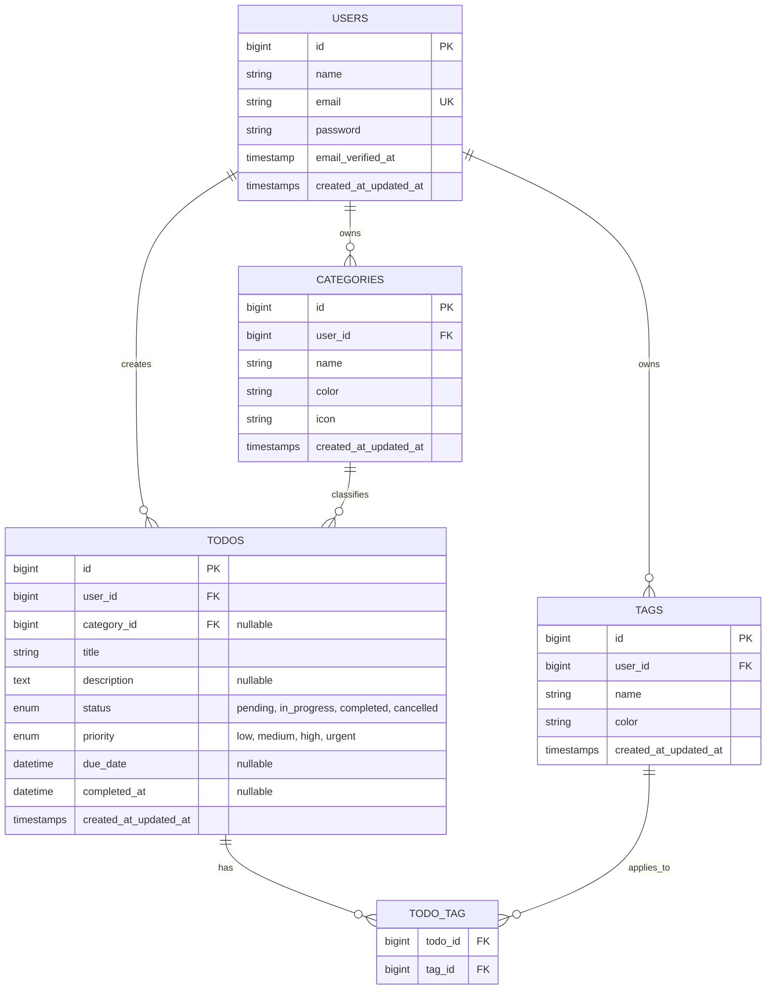

# Product Requirement Document (PRD)
## Full-Stack Monorepo Todo Application (Laravel + React + shadcn/ui)

- **Status:** Draft / Under Review
- **Version:** 1.0.0
- **Author:** Engineering Team
- **Target Audience:** Frontend/Backend Engineers, DevOps, QA, Product Stakeholders

---

## 1. Executive Summary & Goals

### 1.1 Overview
The goal is to build a modern, high-performance, and scalable **Todo & Task Management Application** organized as a **Monorepo**. 

The system leverages:
- **Backend:** Laravel (RESTful API architecture, JWT authentication, Policy-based authorization, self-documenting codebases).
- **Frontend:** React (TypeScript, Vite, Tailwind CSS, shadcn/ui component ecosystem).
- **Architecture:** Monorepo containing decoupled frontend and backend applications with unified scripts and version control.

### 1.2 Core Objectives
- **Enterprise-Grade Architecture:** Decoupled frontend client consuming a robust, strictly typed Laravel API.
- **Security & Multi-Tenancy (User Isolation):** Stateless JWT-based authentication with strict ownership validation (users can only interact with their own todos and categories).
- **Design Excellence:** Accessible, responsive, and aesthetic UI powered by shadcn/ui and Tailwind CSS with dark/light mode support.
- **Developer Experience & Code Quality:** Self-documenting classes and methods using standard PHPDoc / TSDoc annotations, strict typing, and consistent naming conventions.

---

## 2. Monorepo Architecture & Directory Structure

To keep backend and frontend organized in a single repository while keeping their concerns modular, we employ a clean workspace layout:

```text
todo-list-laravel/
├── apps/
│   ├── backend/               # Laravel 11+ REST API Application
│   │   ├── app/
│   │   │   ├── Http/
│   │   │   │   ├── Controllers/Api/v1/
│   │   │   │   ├── Middleware/
│   │   │   │   ├── Requests/          # Form Requests for validation
│   │   │   │   └── Resources/         # Eloquent API Resources
│   │   │   ├── Models/
│   │   │   ├── Policies/              # Authorization policies
│   │   │   └── Services/              # Business logic & domain services
│   │   ├── database/
│   │   │   ├── migrations/
│   │   │   └── seeders/
│   │   ├── routes/
│   │   │   └── api.php
│   │   ├── tests/
│   │   └── composer.json
│   │
│   └── frontend/              # React + Vite SPA
│       ├── public/
│       ├── src/
│       │   ├── assets/
│       │   ├── components/
│       │   │   ├── ui/                # shadcn/ui primitives
│       │   │   ├── auth/              # Login, register forms
│       │   │   ├── todos/             # Todo list, item, dialogs, filters
│       │   │   └── layout/            # Navbar, sidebar, theme-toggle
│       │   ├── hooks/                 # Custom React hooks (auth, todos)
│       │   ├── lib/                   # Axios client, utils, formatters
│       │   ├── pages/                 # Route page views
│       │   ├── routes/                # Router configuration
│       │   ├── services/              # API caller services (TSDoc documented)
│       │   ├── types/                 # TypeScript interfaces & DTOs
│       │   ├── App.tsx
│       │   └── main.tsx
│       ├── components.json            # shadcn/ui configuration
│       ├── package.json
│       ├── tailwind.config.js
│       └── vite.config.ts
│
├── docker/                    # Docker container definitions
│   ├── backend/
│   │   ├── Dockerfile.dev     # PHP-FPM 8.2/8.3 with Xdebug & dev extensions
│   │   ├── Dockerfile.prod    # Multi-stage optimized PHP-FPM with OPcache
│   │   └── php.ini            # Custom PHP configuration
│   ├── frontend/
│   │   ├── Dockerfile.dev     # Node.js 20 Alpine container for Vite HMR
│   │   └── Dockerfile.prod    # Multi-stage static build -> Nginx Alpine
│   └── nginx/
│       ├── default.dev.conf   # Reverse proxy: /api -> backend, / -> vite
│       └── default.prod.conf  # Production gateway with security & caching headers
│
├── docs/                      # Architectural diagrams & API documentation
├── docker-compose.dev.yml     # Local dev orchestration (live reload, volume mounts)
├── docker-compose.prod.yml    # Production simulation orchestration (optimized builds)
├── .env.docker.example        # Environment variable template for Docker
├── .gitignore
├── package.json               # Root workspace scripts (pnpm / npm / yarn)
└── README.md
```

---

## 3. Technology Stack & Key Dependencies

### 3.1 Backend (Laravel)
| Layer / Tool | Technology | Purpose |
| :--- | :--- | :--- |
| **Framework** | Laravel 11.x (PHP 8.2+) | Robust backend MVC framework used as pure REST API |
| **Authentication** | `php-open-source-saver/jwt-auth` | Modern, maintained JSON Web Token guard for Laravel |
| **Authorization** | Laravel Gate & Policies | Granular resource-level authorization (`TodoPolicy`, `CategoryPolicy`) |
| **Validation** | Form Request Classes | Dedicated validation layers with custom messages and rules |
| **Transformation** | Eloquent API Resources | Strict serialization and formatting of API responses |
| **Database** | PostgreSQL / MySQL / SQLite | Relational database storage with foreign key constraints |
| **Testing** | Pest PHP or PHPUnit | Feature and unit tests for API endpoints |

### 3.2 Frontend (React)
| Layer / Tool | Technology | Purpose |
| :--- | :--- | :--- |
| **Runtime & Build** | Vite + React 18/19 (TypeScript) | Fast build tool and type-safe frontend |
| **UI Library** | shadcn/ui (Radix UI primitives) | Accessible, unstyled UI components customized via Tailwind CSS |
| **Styling** | Tailwind CSS + `lucide-react` | Utility-first styling with modern iconography |
| **State & Fetching**| TanStack Query (React Query) + Axios | Server state management, auto-caching, optimistic UI updates, retry logic, and JWT interceptors |
| **Routing** | React Router v6 | Client-side routing with protected route guards |
| **Forms & Validation**| React Hook Form + Zod | High-performance form state and schema-based validation |
| **Toasts / Alerts** | Sonner (`shadcn/ui` toast) | Elegant feedback notifications for user actions and optimistic rollback alerts |

---

## 4. System Capabilities & Functional Requirements

### 4.1 Authentication & Authorization
- **User Registration:**
  - Name, Email, Password, Password Confirmation.
  - Server-side email format validation and password complexity enforcement.
- **JWT Login & Session:**
  - Email and password verification.
  - Returns `access_token`, `token_type` (Bearer), and `expires_in`.
  - Frontend stores token securely and attaches it via an Axios authorization interceptor (`Authorization: Bearer <token>`).
- **Token Refresh & Invalidation:**
  - Token refresh endpoint (`POST /api/v1/auth/refresh`).
  - Graceful token expiration handling on frontend with auto-redirect to `/login`.
  - Logout endpoint (`POST /api/v1/auth/logout`) blacklisting the active token.
- **Authorization & Data Isolation:**
  - Every Todo, Category, and Tag strictly belongs to a specific `user_id`.
  - Laravel Policies check `$user->id === $todo->user_id`. Unauthorized requests return `403 Forbidden`.

### 4.2 Todo & Task Management
- **CRUD Operations:**
  - Create, view, update, and delete tasks.
  - Fields: Title, description, status (`pending`, `in_progress`, `completed`, `cancelled`), priority (`low`, `medium`, `high`, `urgent`), due date, category, and tags.
- **Optimistic UI Experience:**
  - **Zero-Latency Toggle:** Checking/unchecking a task immediately reflects visually without waiting for network roundtrip.
  - **Instant Deletion:** Cards immediately fade out from the list; on network failure, item is restored with a warning toast.
  - **Instant Edits:** In-place modifications to priority, category, or title apply instantaneously.
- **Quick Status Toggle:**
  - Single-click toggle between `completed` and `pending` directly from the task list.
- **Categories & Tags:**
  - Custom user categories (e.g., "Work", "Personal", "Health") with custom color indicators.
  - Multi-tag assignment for flexible classification.
- **Subtasks / Checklist (Optional Enhancement):**
  - Ability to break down tasks into bite-sized actionable checklist items.
- **Search, Filter & Sorting:**
  - Real-time search query on title and description.
  - Filter by status, priority, category, and date range (Today, This Week, Overdue).
  - Sort by Due Date, Priority, or Creation Date (Asc/Desc).
- **Batch / Bulk Actions:**
  - Bulk mark as completed, bulk delete, bulk categorize.

### 4.3 User Experience & Dashboard
- **Analytics / Overview widget:**
  - Total tasks, completed tasks, overdue tasks count, and overall completion rate progress bar.
- **Theme support:**
  - Light, dark, and system preference options with smooth transitions.

---

## 5. Database Schema & Models



---

## 6. REST API Specification

All routes are prefixed with `/api/v1` and return standardized JSON envelopes.

### Standard Response Envelope:
```json
{
  "success": true,
  "message": "Operation successful.",
  "data": {},
  "meta": {
    "current_page": 1,
    "last_page": 5,
    "total": 50
  }
}
```

### Endpoints Overview:

| Method | Endpoint | Description | Protected |
| :--- | :--- | :--- | :--- |
| `POST` | `/auth/register` | Register new account and issue token | No |
| `POST` | `/auth/login` | Authenticate credentials and issue token | No |
| `POST` | `/auth/logout` | Invalidate current JWT token | Yes |
| `POST` | `/auth/refresh` | Refresh expired/expiring JWT token | Yes |
| `GET` | `/auth/me` | Retrieve authenticated user profile | Yes |
| `GET` | `/todos` | List paginated todos with query filters | Yes |
| `POST` | `/todos` | Create a new todo | Yes |
| `GET` | `/todos/{id}` | Show details of a specific todo | Yes |
| `PUT/PATCH`| `/todos/{id}` | Update title, description, priority, category | Yes |
| `PATCH` | `/todos/{id}/toggle` | Quick toggle completion status | Yes |
| `DELETE` | `/todos/{id}` | Soft/Hard delete a todo | Yes |
| `GET` | `/todos/summary` | Get aggregated stats (completed, overdue, count) | Yes |
| `GET` | `/categories` | List user's categories | Yes |
| `POST` | `/categories` | Create user category | Yes |
| `DELETE` | `/categories/{id}` | Delete user category | Yes |
| `GET` | `/tags` | List user's tags | Yes |
| `POST` | `/tags` | Create user tag | Yes |

---

## 7. Self-Documenting Code Standards

A core design requirement is that every class, method, and function must be **self-documenting**, expressive, and clean.

### 7.1 Backend (PHP / Laravel Guidelines)
1. **Strict Types:** Every PHP file must declare `declare(strict_types=1);`.
2. **Standardized PHPDoc:**
   - Class-level docblocks explaining responsibility and domain layer.
   - Method-level docblocks detailing params, return types, and potential thrown exceptions.
3. **Expressive Method Naming:** Methods should convey domain intent (e.g., `markAsCompleted()`, `assignTags()`, `filterByStatus()`).
4. **Separation of Concerns:**
   - **Controllers:** Thin; responsible solely for request extraction and dispatching to services or queries.
   - **Form Requests:** Handle authorization and validation rules.
   - **Domain Services:** Contain multi-step business logic (e.g., `TodoService`).
   - **API Resources:** Format outbound JSON representations.

#### Backend Code Example:
```php
<?php

declare(strict_types=1);

namespace App\Services;

use App\Models\Todo;
use App\Models\User;
use App\Http\Requests\Todo\CreateTodoRequest;
use Illuminate\Support\Carbon;

/**
 * Class TodoService
 *
 * Handles domain operations and lifecycle management for user Todo items.
 */
class TodoService
{
    /**
     * Create a new Todo item for the authenticated user.
     *
     * @param User $user The task owner.
     * @param array<string, mixed> $attributes Validated payload attributes.
     * @return Todo The newly created and persisted Todo model instance.
     */
    public function createTodo(User $user, array $attributes): Todo
    {
        return $user->todos()->create([
            'title' => $attributes['title'],
            'description' => $attributes['description'] ?? null,
            'priority' => $attributes['priority'] ?? 'medium',
            'status' => 'pending',
            'category_id' => $attributes['category_id'] ?? null,
            'due_date' => isset($attributes['due_date']) ? Carbon::parse($attributes['due_date']) : null,
        ]);
    }

    /**
     * Toggle the completion status of a given Todo item.
     *
     * @param Todo $todo The task to toggle.
     * @return Todo The refreshed task with updated timestamp and status.
     */
    public function toggleCompletion(Todo $todo): Todo
    {
        $isCompleted = $todo->status === 'completed';
        
        $todo->update([
            'status' => $isCompleted ? 'pending' : 'completed',
            'completed_at' => $isCompleted ? null : Carbon::now(),
        ]);

        return $todo->fresh();
    }
}
```

### 7.2 Frontend (React / TypeScript Guidelines)
1. **TypeScript Strict Mode:** Explicit interface declarations for all props, states, and API payloads; zero `any` usage.
2. **TSDoc Documentation:** Public utility functions, hooks, and service methods documented with TSDoc (`/** ... */`).
3. **Explicit Component Interfaces:** Dedicated `Props` interfaces for every component.

#### Frontend Code Example:
```typescript
/**
 * Service function to retrieve paginated todos based on filter parameters.
 *
 * @param filters - Query filters such as status, priority, category, and page.
 * @returns A promise resolving to the standardized API response containing Todo items and pagination metadata.
 * @throws {AxiosError} When the network request fails or authentication is unauthorized.
 */
export async function getTodos(filters: TodoFilterParams): Promise<ApiResponse<Todo[]>> {
  const response = await apiClient.get<ApiResponse<Todo[]>>('/todos', { params: filters });
  return response.data;
}
```

---

## 8. Frontend UI / UX Specifications (shadcn/ui)

### 8.1 Key UI Components Required
- **Layout:**
  - `Sidebar` & `Header`: Navigation, active category filters, user avatar profile menu, and dark mode toggle.
- **Task Management:**
  - `DataTable` / `CardList`: Responsive view displaying tasks with status checkbox, badges for priority and tags, and due date indicators.
  - `Dialog` & `Sheet`: Modal for creating and editing tasks with full form controls (DatePicker, Select, Input, Textarea).
  - `DropdownMenu`: Row actions (Edit, Duplicate, Move Category, Delete).
  - `AlertDialog`: Confirmation prompt before permanent deletion of tasks or categories.
- **Feedback & States:**
  - `Skeleton`: Loading states during initial fetch and pagination.
  - `Sonner Toast`: Real-time success and error toasts for all mutations.
  - `EmptyState`: Visually pleasant illustration/empty widget when no tasks match current filters.

### 8.2 Design Tokens & Themes
- **Color Scheme:** Neutral / Slate base palette with vibrant accents (e.g., Indigo / Violet).
- **Priority Indicators:**
  - Urgent: Destructive red badge.
  - High: Amber/Orange badge.
  - Medium: Sky blue badge.
  - Low: Slate/Muted badge.

### 8.3 Optimistic UI Architecture (TanStack Query)

To deliver a snappy, native-like user experience, user interactions (status toggling, editing, deleting, and quick task creation) use TanStack Query's optimistic update pattern:

1. **Status Toggling (`useToggleTodoMutation`):**
   - **`onMutate`:**
     - Cancel any in-flight refetches for `['todos']` so they don't overwrite optimistic data.
     - Snapshot the previous todos list and summary stats from cache.
     - Optimistically mutate the matching task (`status: 'completed'` / `'pending'`, and recalculate `summary` counts).
     - Return snapshot context for potential rollback.
   - **`onError`:**
     - Roll back the query cache to the snapshot.
     - Trigger `toast.error("Failed to update status. Reverting changes.")`.
   - **`onSettled`:**
     - Invalidate `['todos']` and `['todos', 'summary']` to re-sync with authoritative server state.

2. **Instant Deletion (`useDeleteTodoMutation`):**
   - **`onMutate`:** Filter out the deleted todo from active view immediately.
   - **`onError`:** Restore previous todo list and inform the user of failure.
   - **`onSettled`:** Invalidate queries.

3. **Optimistic Task Creation:**
   - Prepend a temporary task item with a client-generated UUID and an `isPending: true` subtle opacity/shimmer state.
   - Replace with the authoritative persisted model once the server returns HTTP 201.

#### Example Optimistic Hook:
```typescript
/**
 * Custom hook to toggle todo completion status with optimistic UI updates.
 */
export function useToggleTodo() {
  const queryClient = useQueryClient();

  return useMutation({
    mutationFn: (todoId: number) => todoService.toggleStatus(todoId),
    onMutate: async (todoId: number) => {
      await queryClient.cancelQueries({ queryKey: ['todos'] });
      const previousTodos = queryClient.getQueryData<ApiResponse<Todo[]>>(['todos']);

      if (previousTodos) {
        queryClient.setQueryData<ApiResponse<Todo[]>>(['todos'], {
          ...previousTodos,
          data: previousTodos.data.map((todo) =>
            todo.id === todoId
              ? {
                  ...todo,
                  status: todo.status === 'completed' ? 'pending' : 'completed',
                  completed_at: todo.status === 'completed' ? null : new Date().toISOString(),
                }
              : todo
          ),
        });
      }

      return { previousTodos };
    },
    onError: (_err, _todoId, context) => {
      if (context?.previousTodos) {
        queryClient.setQueryData(['todos'], context.previousTodos);
      }
      toast.error('Could not update task. Changes reverted.');
    },
    onSettled: () => {
      queryClient.invalidateQueries({ queryKey: ['todos'] });
      queryClient.invalidateQueries({ queryKey: ['todos', 'summary'] });
    },
  });
}
```

---

## 9. Non-Functional Requirements & Security

1. **Security:**
   - Password hashing with Bcrypt/Argon2.
   - CORS policy configured to allow only the frontend origin.
   - XSS protection and SQL injection prevention via Eloquent ORM.
   - Rate limiting on authentication routes (`throttle:6,1` for login/register).
2. **Performance:**
   - Database indexes on `(user_id, status)`, `(user_id, due_date)`, and `(user_id, category_id)`.
   - Eager loading of relations (`with(['category', 'tags'])`) to avoid N+1 query problems.
3. **Accessibility (a11y):**
   - Radix UI primitive compliance for keyboard navigation, focus management, and screen reader ARIA roles.

---

## 10. Containerization & Server Simulation (Docker & Docker Compose)

To provide an environment that closely simulates production servers while preserving optimal local developer velocity, the application provides dual Docker configurations:
1. **Development (`docker-compose.dev.yml`)**: Hot-reloading, volume-mounted code, live debugging, and unified Nginx proxying.
2. **Production Simulation (`docker-compose.prod.yml`)**: Multi-stage optimized builds, OPcache acceleration, static asset serving via Nginx Alpine, and hardened container isolation.

### 10.1 System Topology & Container Architecture

```mermaid
flowchart TB
    Client["Client Browser (Port 8080 / 80)"]

    subgraph DockerNetwork["Isolated Bridge Network (todo_network)"]
        Nginx["Reverse Proxy Gateway (Nginx)"]
        FrontendDev["Frontend Container (Node 20 / Vite HMR)"]
        FrontendProd["Frontend Container (Nginx Alpine Static Host)"]
        Backend["Backend Container (PHP 8.2+ FPM)"]
        Database[("PostgreSQL 16 Database")]
        Redis[("Redis 7 Cache / Queue")]
    end

    Client -->|HTTP / WebSocket| Nginx
    Nginx -->|Route /* (Dev)| FrontendDev
    Nginx -->|Route /* (Prod)| FrontendProd
    Nginx -->|Route /api/* (FastCGI / HTTP)| Backend
    Backend -->|SQL Connection| Database
    Backend -->|Cache / Queue| Redis
```

### 10.2 Development Environment (`docker-compose.dev.yml`)

The development environment guarantees instant feedback loops without installing PHP, Composer, or Node directly on the host machine.

#### Service Specifications:
1. **`nginx-gateway`:**
   - Image: `nginx:alpine`
   - Port: `8080:80`
   - Role: Single entry point. Routes `http://localhost:8080/api/*` to PHP-FPM and `http://localhost:8080/*` to the Vite React dev server.
   - Benefit: **Zero CORS configuration required** during development because both frontend and API share the exact same origin.
2. **`backend-api`:**
   - Base Image: `php:8.2-fpm-alpine` (or Debian slim)
   - Extensions: `pdo_pgsql`, `pdo_mysql`, `bcmath`, `mbstring`, `zip`, `opcache`, and optionally `xdebug`.
   - Volumes: `apps/backend:/var/www/backend` (live code sync), with a dedicated volume for Composer vendor caching.
   - Command: `php-fpm`
3. **`frontend-spa`:**
   - Base Image: `node:20-alpine`
   - Volumes: `apps/frontend:/app` (live code sync), anonymous volume for `node_modules` to prevent OS host path conflicts.
   - Command: `npm run dev -- --host 0.0.0.0 --port 5173`
   - Vite WebSocket support: Nginx configuration passes `Upgrade` and `Connection` headers for instant Hot Module Replacement (HMR).
4. **`database`:**
   - Image: `postgres:16-alpine` (or `mysql:8.0`)
   - Volumes: `todo_pgdata:/var/lib/postgresql/data` (persistent database volume).
   - Healthcheck: Automated `pg_isready` check before backend container runs migrations.
5. **`redis`:**
   - Image: `redis:7-alpine`
   - Role: Fast session handling, API rate limiting, and cache driver.

### 10.3 Production Simulation Environment (`docker-compose.prod.yml`)

The production configuration mirrors cloud container deployments (such as AWS ECS, GCP Cloud Run, or Kubernetes).

#### Multi-Stage Build Pipeline:

#### 1. Backend (`docker/backend/Dockerfile.prod`):
- **Stage 1 (Builder):**
  - Uses `composer:2` image to run `composer install --no-dev --optimize-autoloader --no-interaction --prefer-dist`.
- **Stage 2 (Runtime):**
  - Base: `php:8.2-fpm-alpine`.
  - OPcache configuration enabled (`opcache.validate_timestamps=0`, `opcache.memory_consumption=128`).
  - Production `php.ini` with disabled error display and hardened security limits.
  - Copies application source and pre-built `vendor/` directory from builder.
  - Runs as non-root user (`USER www-data`).
  - Includes a lightweight container healthcheck (`php-fpm-healthcheck` or HTTP probe).

#### 2. Frontend (`docker/frontend/Dockerfile.prod`):
- **Stage 1 (Builder):**
  - Base: `node:20-alpine`.
  - Runs `npm ci` and `npm run build` with production environment variables (`VITE_API_URL=/api/v1`).
- **Stage 3 (Runtime):**
  - Base: `nginx:alpine`.
  - Copies compiled static assets from `/app/dist` to `/usr/share/nginx/html`.
  - Configures `try_files $uri $uri/ /index.html;` for React Router HTML5 History API.
  - Applies HTTP caching headers: `Cache-Control "public, max-age=31536000, immutable"` for hashed asset bundles, and `no-cache` for `index.html`.

#### 3. Edge Nginx Gateway (`docker/nginx/default.prod.conf`):
- Gzip / Brotli compression for JSON responses and JS/CSS assets.
- Security Headers:
  - `X-Content-Type-Options: nosniff`
  - `X-Frame-Options: SAMEORIGIN`
  - `X-XSS-Protection: 1; mode=block`
  - `Referrer-Policy: strict-origin-when-cross-origin`
- FastCGI buffering optimization for Laravel API payloads.

### 10.4 Environment Configuration & Security

- **`.env.docker.example`**: Standardized environment variables template covering:
  - `APP_ENV`, `APP_KEY`, `APP_DEBUG=false`
  - `DB_CONNECTION=pgsql`, `DB_HOST=database`, `DB_PORT=5432`, `DB_DATABASE=todo_app`, `DB_USERNAME=todo_user`, `DB_PASSWORD=secret`
  - `JWT_SECRET=...`
  - `CACHE_STORE=redis`, `REDIS_HOST=redis`
- **Network Isolation:** Internal services (`backend`, `database`, `redis`) communicate over an internal Docker network (`todo_network`) and are not exposed directly to the host machine unless explicitly bound in development.

### 10.5 Developer Docker Workflow Cheatsheet

| Task | Command |
| :--- | :--- |
| **Start Dev Environment** | `docker compose -f docker-compose.dev.yml up -d --build` |
| **Stop Dev Environment** | `docker compose -f docker-compose.dev.yml down` |
| **View Dev Logs** | `docker compose -f docker-compose.dev.yml logs -f` |
| **Run Migrations & Seeds** | `docker compose -f docker-compose.dev.yml exec backend-api php artisan migrate --seed` |
| **Generate JWT Secret** | `docker compose -f docker-compose.dev.yml exec backend-api php artisan jwt:secret` |
| **Run Backend Tests** | `docker compose -f docker-compose.dev.yml exec backend-api php artisan test` |
| **Run Production Simulation** | `docker compose -f docker-compose.prod.yml up -d --build` |

---

## 11. Development Phases & Implementation Roadmap

| Phase | Milestone | Deliverables |
| :--- | :--- | :--- |
| **Phase 1** | **Monorepo, Docker & Environment Setup** | Root workspace setup, Docker development containers (`docker-compose.dev.yml`), Laravel app init in `apps/backend`, React + Vite app in `apps/frontend`, Tailwind and shadcn/ui installation. |
| **Phase 2** | **Backend Core & Auth (JWT)** | Migrations, User model, JWT authentication package configuration, AuthController, FormRequests, and Token refresh flows. |
| **Phase 3** | **Backend Todo & Category Domain** | Database migrations for Todos, Categories, Tags, Policies, TodoService, API Resources, and unit/feature tests. |
| **Phase 4** | **Frontend Auth & State Setup** | Axios client with JWT interceptor, AuthProvider, Login & Register pages with Zod validation, and protected routes. |
| **Phase 5** | **Frontend Todo Dashboard & shadcn/ui** | Layout components, Task List, Task Creation Dialog, Category Filter, Priority Badges, and Sonner notifications. |
| **Phase 6** | **Search, Filtering & Analytics** | Due date filtering, search bar, sort options, and summary metrics cards. |
| **Phase 7** | **Production Docker & Polishing** | Multi-stage production Dockerfiles (`docker-compose.prod.yml`), OPcache & Nginx tuning, PHPDoc/TSDoc audits, responsive mobile testing, and comprehensive README documentation. |

